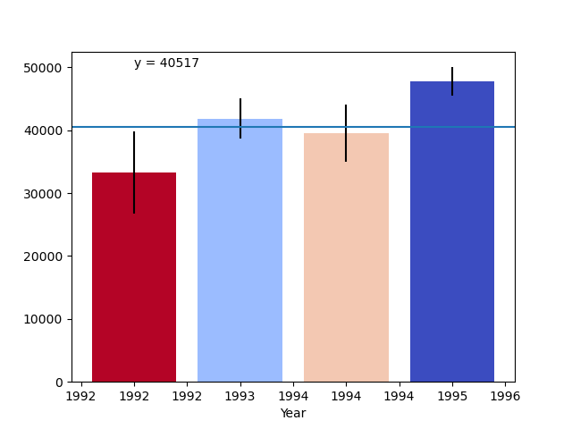
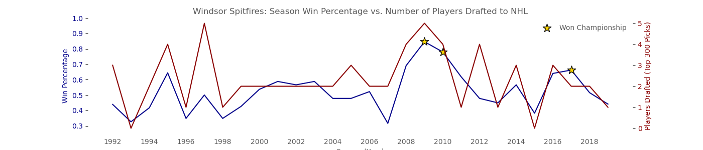

# PythonPlotting

Assignments for course 'Applied Plotting, Charting &amp; Data Representation in Python' from the University of Michigan

## [Plotting Weather Patterns](weather_patterns)

  

The [data](weather_patterns/C2A2_data.csv) for this assignment comes from a subset of The National Centers for Environmental Information (NCEI) [Daily Global Historical Climatology Network](https://www1.ncdc.noaa.gov/pub/data/ghcn/daily/readme.txt) (GHCN-Daily). The GHCN-Daily is comprised of daily climate records from thousands of land surface stations across the globe. The data subset used is near **Ann Arbor, Michigan, United States**.

The [code](weather_patterns/code.py) generates a line graph of the record high and record low temperatures by day of the year over the period 2005-2014. The area between the record high and record low temperatures for each day is shaded. Overlaid is a scatter plot of the 2015 data for any points (highs and lows) for which the ten year (2005-2014) record high or record low was broken in 2015.

## [Understanding Distributions Through Sampling](distributions)

The [code](distributions/code.py) creates an animation, pulling between 100 and 2000 samples from each of the random variables (x1, x2, x3, x4) for each plot using matplotlib subplots.

## [Building a Custom Visualization](interactive_vizualization)

The assignment uses the approach outlined in Ferreira et al.

&nbsp;&nbsp;&nbsp;&nbsp;&nbsp;&nbsp;Ferreira, N., Fisher, D., & Konig, A. C. (2014, April). [Sample-oriented task-driven visualizations: allowing users to make better, more confident decisions.](https://www.microsoft.com/en-us/research/wp-content/uploads/2016/02/Ferreira_Fisher_Sample_Oriented_Tasks.pdf). In Proceedings of the SIGCHI Conference on Human Factors in Computing Systems (pp. 571-580). ACM. ([video](https://www.youtube.com/watch?v=BI7GAs-va-Q))

  

The [code](interactive_vizualization/code.py) creates a bar chart with user input: the user can click the plot in order to set a custom y-axis. Each bar represents data from a larger distribution by year, plotted using the mean for each year and error bars representing a 95% confidence interval. The colours of each bar represent how likely the selected y value will fall within a bar's respective distribution (i.e., a color scale from red to blue with white representing a y value equal to the year's mean).

## [Correlations in Sports Data](spits)

Research Question: Is the season-by-season win percentage of the Windsor Spitfires junior ice hockey team correlated with the number of players selected from the team in the top 300 picks of each season's NHL draft?

  

The visual addresses the research question by displaying the relevant trends (win percentage and number of players drafted) on the same plot, which highlights the overlap in the patters of both sets of data across the same range of seasons (1992-2019). 

It is clear from the graph that when the team has a low win percentage (i.e., the team did not do well that season) the team does not have many players drafted to the NHL. However, when a team has a higher win percentage (and perhaps sometimes wins the championship) the team sees more of their players drafted in the top 300 picks. In general, the two data sets follow a similar trend.

The correlation coefficient between the two data sets is 0.6342, indicating a moderate-to-strong positive correlation. 

draft data from https://www.hockey-reference.com/play-index/draft_finder.cgi

season by season data from https://www.hockeydb.com/stte/windsor-spitfires-10926.html
